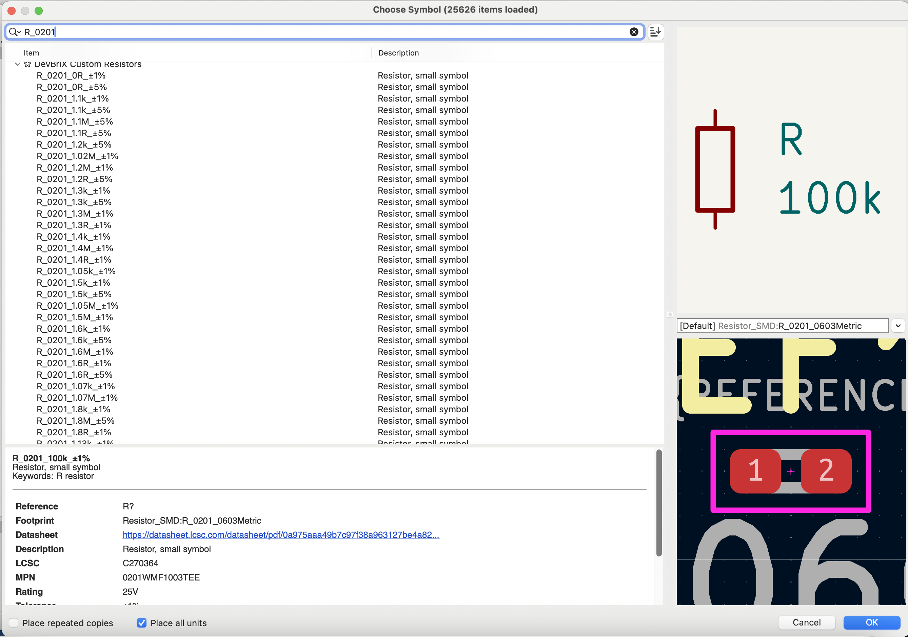
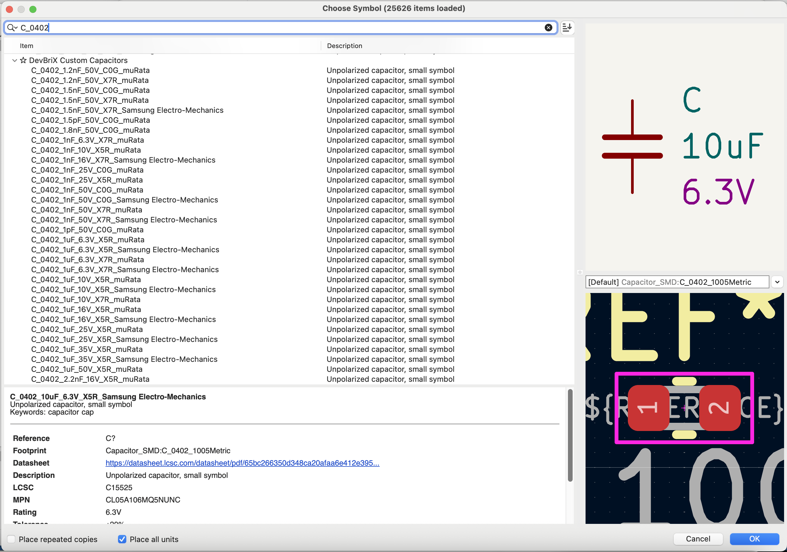
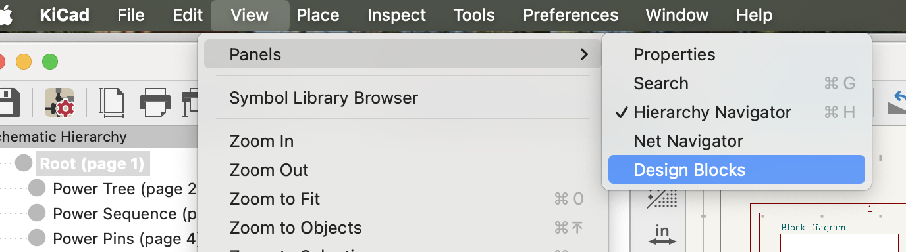
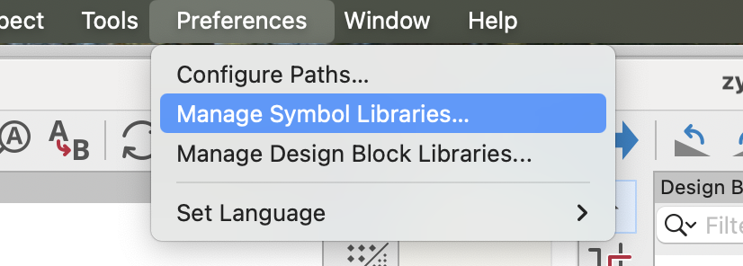
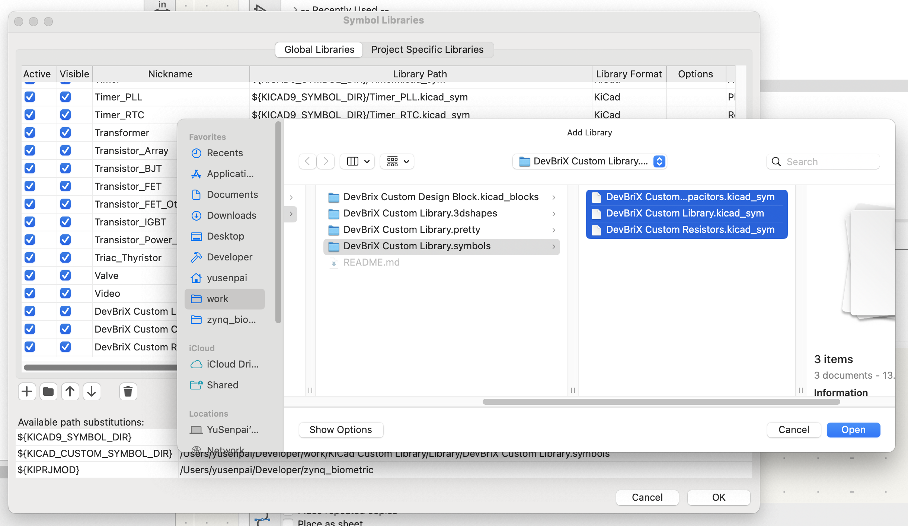

# Giới thiệu
Nếu bạn đã quá mệt mỏi vì phải điền từng mã LCSC cho từng con trở, từng con tụ,... thì đây là thư viện dành cho bạn.
Thư viện này dành cho KiCad9+, gồm:
- Thư viện symbol điện trở
- Thư viện symbol tụ điện
- Thư viện symbol, footprint và 3D của một số linh kiện hay dùng
- Thư viện design block của một số thiết kế thường dùng

Thư viện điện trở và tụ điện đã được điền sẵn các thông số từ lấy từ LCSC, từ giá trị, kiểu đóng gói, điện áp định mức cho tới giá tiền, mã LCSC.

# Cấu trúc thư mục
- DevBriX Custom Library.symbols: chứa symbol
- DevBriX Custom Library.pretty: chứa footprint
- DevBriX Custom Library.3dshapes: chứa 3d
- DevBrix Custom Design Block.kicad_blocks: chứa các design block hay sử dụng

# Thư viện Symbol
Thư viện điện trở được lấy từ:
- UNI-ROYAL, sai số 1% và 5%, kiểu đóng gói 0201, 0402, 0603
- YAEGO, một số trở đo dòng, kiểu đóng gói 0612, 0805, 1206, 1210

Cách đặt tên: `R_[kiểu đóng gói]_[giá trị]_[sai số]`. Ví dụ: R_0201_1.5k_±1%

Thư viện tụ điện được lấy từ:
- Samsung Electro-Mechanics, kiểu đóng gói 0201, 0402, 0603, 0805, vật liệu X5R và X7R
- muRata, kiểu đóng gói 0201, 0402, 0603, 0805, vật liệu X5R và X7R

Cách đặt tên: `C_[kiểu đóng gói]_[giá trị]_[vật liệu]_[điện áp]_[nhà sản xuất]`. Ví dụ: C_0603_2.2uF_X5R_25V_muRata

# Thư viện Design Block
Thư viện này chứa một số thiết kế mẫu cho các mạch thông dụng.

Để sử dụng thư viện design block, chọn View -> Panels -> Design Blocks

# Sử dụng
Thêm thư viện symbol: trong KiCad Schematic, chọn Preferences -> Manage Symbol Libraries... rồi trỏ tới các file symbol:

